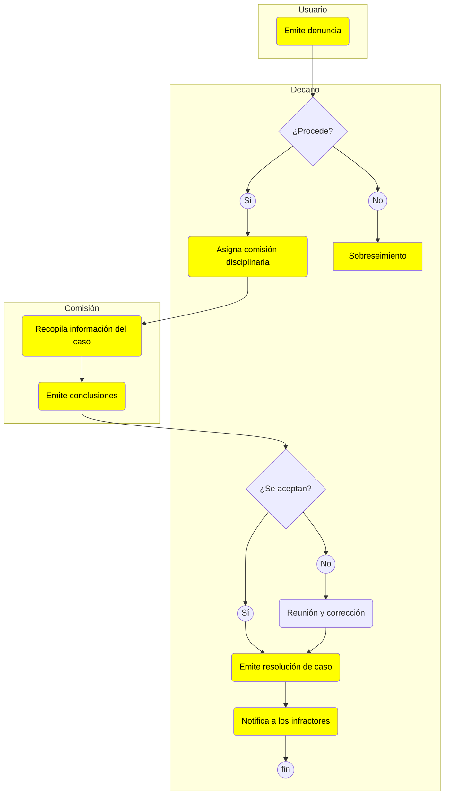
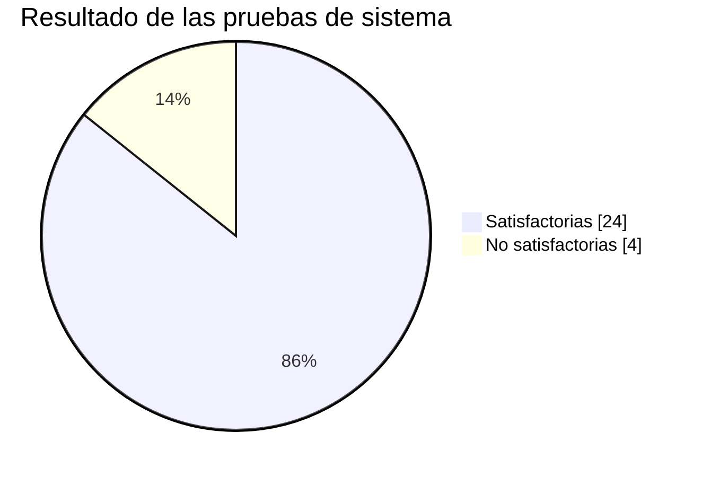

 <!-- style Usuario fill:#efe;
    style Decano fill:#eef;
    style Comisión fill:#fef; -->

## Proceso de comisión disciplinaria

```mermaid
graph TD
    denuncia(Emite denuncia):::auto-->proceeds{"¿Procede?"}-->sip((Sí))-->assign(Asigna comisión disciplinaria):::auto-->info(Recopila información del caso):::auto-->conc(Emite conclusiones):::auto-->ac{"¿Se aceptan?"}-->sic((Sí))-->emit_case_resolution(Emite resolución de caso):::auto-->notif(Notifica a los infractores):::auto-->fin((fin))

    proceeds-->nop((No))-->Sobreseimiento:::auto
    ac-->noc((No))-->reunion(Reunión y corrección)-->emit_case_resolution

    classDef auto fill:yellow,color:black;
    class denuncia auto;
   

    subgraph Usuario
    denuncia
    end
    subgraph Decano
    proceeds & sip & nop & assign & Sobreseimiento & ac & sic & noc & emit_case_resolution & notif & reunion & fin
    end
    subgraph Comisión
    info & conc
    end
```

```mermaid
pie showData
    title Resultado de las pruebas de sistema
    "Satisfactorias" : 24
    "No satisfactorias" : 4
```
